# GreenGarden

<p align="center">
  
</p>

<p align="center">
  <strong>IB Computer Science Internal Assessment (IA) Project</strong><br>
  <em>IB Computer Science SL | March 2023</em>
</p>

<p align="center">
  <a href="#features">Features</a> •
  <a href="#screenshots">Screenshots</a> •
  <a href="#installation">Installation</a> •
  <a href="#usage">Usage</a> •
  <a href="#documentation">Documentation</a>
</p>

---

A JavaFX desktop application for **sustainable garden planning** that helps users design eco-friendly gardens with personalized plant recommendations, environmental impact reports, and maintenance schedules.

---

## About the Project

**GreenGarden** was developed as an **IB Computer Science Internal Assessment (IA)** project to address real-world sustainability challenges in home gardening.

| Role | Name |
|------|------|
| **Developer** | Rohan Muppa |
| **Client** | Latha Muppa |
| **Advisor** | Peter Donaldson |
| **Instructor** | Ms. Nishiwaki |

---

## The Problem

The client, **Latha Muppa**, is a recreational gardener who faces challenges managing her backyard garden:

```
┌─────────────────────────────────────────────────────────────────────┐
│                        CLIENT CHALLENGES                            │
├─────────────────────────────────────────────────────────────────────┤
│  😕 Limited knowledge about sustainable gardening practices         │
│  🌱 Difficulty identifying plants suitable for local climate        │
│  🔧 No existing tool to manage garden efficiently                   │
│  🌿 Desire for organic produce with minimal environmental impact    │
│  📅 Need for guidance on garden planning and maintenance            │
└─────────────────────────────────────────────────────────────────────┘
```

---

## The Solution

GreenGarden enables users to **plan, track, and improve** their sustainable gardens:

```mermaid
flowchart LR
    A[👤 User Input] --> B[🌱 GreenGarden]
    B --> C[📋 Plant Recommendations]
    B --> D[🌍 Environmental Report]
    B --> E[📅 Maintenance Schedule]
    B --> F[💡 Garden Tips]
```



---

## Features

### Core Functionality

| Feature | Description |
|---------|-------------|
| 🌱 **Plant Recommendations** | Filters plants based on zip code, sun exposure, maintenance level, and budget |
| 🌍 **Environmental Report** | Calculates CO2 sequestered and water saved vs. traditional gardens |
| 💰 **Budget Management** | Ensures total plant cost stays within budget |
| ✅ **Compatibility Check** | Verifies new plants work with existing garden plants |
| 📅 **Maintenance Schedule** | Generates watering and care schedules |
| 💡 **Garden Tips** | Provides specific recommendations based on plant types |

### Input Parameters


### Supported Plant Categories

<table>
<tr>
<td>🌸 Annuals</td>
<td>🌺 Perennials</td>
<td>🌷 Bulbs</td>
<td>🌳 Shrubs</td>
<td>🌲 Trees</td>
</tr>
<tr>
<td>🍃 Climbers</td>
<td>🌿 Herbs</td>
<td>🥬 Vegetables</td>
<td>🍓 Fruits</td>
<td>🌾 Grasses</td>
</tr>
<tr>
<td>🪴 Succulents</td>
<td>🌵 Cacti</td>
<td>☘️ Ferns</td>
<td>🌴 Palms</td>
<td>🌾 Ornamental Grasses</td>
</tr>
</table>

---

## Screenshots

### Application Interface

<p align="center">
  
</p>

*Main input form with garden parameters and plant type selection*

| Component | Description |
|-----------|-------------|
| Text Fields | Garden size, zip code, budget |
| Dropdowns | Sun exposure, maintenance level |
| Checkbox List | Existing plant types (15 options) |
| Submit Button | Generate recommendations |

### Input Validation

<p align="center">
  
</p>

*Error handling for invalid inputs with user-friendly alerts*

### Sample Output Reports

#### Environmental Report
```
┌─────────────────────────────────────────┐
│         ENVIRONMENTAL REPORT            │
├─────────────────────────────────────────┤
│  Total Cost of Plants:    $127.45       │
│  CO2 Sequestered:         15.20 kg      │
│  Water Saved:             2,450 gallons │
│  Water Savings:           15.3%         │
├─────────────────────────────────────────┤
│  RECOMMENDATIONS:                       │
│  • Use organic fertilizer for annuals   │
│  • Collect rainwater for ferns          │
│  • Use mulch around trees and shrubs    │
└─────────────────────────────────────────┘
```

#### Maintenance Schedule
```
┌─────────────────────────────────────────┐
│         MAINTENANCE SCHEDULE            │
├─────────────────────────────────────────┤
│  Water plants: 8 times per month        │
│  Maintenance days: 3 day(s) per month   │
└─────────────────────────────────────────┘
```

#### Plant List
```
┌─────────────────────────────────────────┐
│         PLANTS IN YOUR GARDEN           │
├─────────────────────────────────────────┤
│  • Lavender (x3)                        │
│  • Tomato (x5)                          │
│  • Basil (x4)                           │
│  • Marigold (x6)                        │
│  • Rosemary (x2)                        │
└─────────────────────────────────────────┘
```

---

## Technical Architecture

### Technology Stack

<p align="center">

| Component | Technology |
|-----------|------------|
| **Language** |  |
| **UI Framework** |  |
| **IDE** |  |
| **Data Storage** | CSV File |

</p>

### Project Structure

```
GreenGarden/
├── 📁 Product/
│   ├── 📄 Main.java            # JavaFX application entry point & UI
│   ├── 📄 Garden.java          # Core garden logic and algorithms
│   ├── 📄 Plant.java           # Plant data model
│   ├── 📄 WaterCalculator.java # Water usage calculations
│   └── 📄 Plants.csv           # Plant database (required)
├── 📁 Documentation/
│   ├── 📕 Crit_A_Planning.pdf
│   ├── 📗 Crit_B_Design.pdf
│   ├── 📘 Crit_B_Record_Of_Tasks.pdf
│   ├── 📙 Crit_C_Development.pdf
│   ├── 📓 Crit_E_Evaluation.pdf
│   └── 📔 Appendix.pdf
├── 📁 images/
└── 📄 README.md
```

### Class Diagram


### Plant Selection Algorithm


### Data Flow


### Data Structures

```mermaid
graph TD
    subgraph HashMap
        A[Plant Compatibility]
        B["Annuals → [Petunia, Marigold, Zinnia]"]
        C["Perennials → [Hosta, Lavender, Daylily]"]
    end

    subgraph ArrayList
        D[newPlants]
        E[Plant 1]
        F[Plant 2]
        G[Plant n...]
    end

    subgraph ObservableList
        H[existingPlantTypes]
        I[UI Binding]
    end

    A --> B
    A --> C
    D --> E
    D --> F
    D --> G
    H --> I
```



---

## Installation

### Prerequisites

- **Java JDK 11+** with JavaFX support
- **JavaFX SDK** (if not bundled)
- **IntelliJ IDEA** (recommended)

### Quick Start

```bash
# 1. Clone the repository
git clone https://github.com/RohanMuppa/GreenGarden.git
cd GreenGarden

# 2. Set up JavaFX (if needed)
# Download from https://openjfx.io/

# 3. Configure Plants.csv path in Garden.java (line 36)

# 4. Run with JavaFX modules
java --module-path /path/to/javafx-sdk/lib \
     --add-modules javafx.controls \
     -cp Product Main
```

### Detailed Setup

<details>
<summary><strong>Option A: JDK with bundled JavaFX</strong></summary>

1. Download Liberica JDK Full or Azul Zulu JDK FX
2. Set `JAVA_HOME` to installation directory
3. Run directly without additional configuration

</details>

<details>
<summary><strong>Option B: Separate JavaFX SDK</strong></summary>

1. Download JavaFX SDK from [openjfx.io](https://openjfx.io/)
2. Extract to known location
3. Add VM options:
```
--module-path /path/to/javafx-sdk/lib --add-modules javafx.controls
```

</details>

<details>
<summary><strong>IntelliJ IDEA Setup</strong></summary>

1. Open project in IntelliJ
2. File → Project Structure → Project → Set SDK
3. File → Project Structure → Libraries → Add JavaFX
4. Run → Edit Configurations → VM Options:
```
--module-path /path/to/javafx-sdk/lib --add-modules javafx.controls
```
5. Run `Main.java`

</details>

### Configure Plant Database

Create `Plants.csv` with this format:

```csv
ID,Name,SunNeeded,WaterNeeded,Cost,Zipcode,Type
1,Petunia,2,1,5.99,12345,Annuals
2,Lavender,3,1,8.99,12345,Perennials
3,Tomato,4,2,3.99,12345,Vegetables
```

---

## Usage


### Step-by-Step

1. **Launch** - Run `Main.java`
2. **Enter Details**
   - Garden size (sq meters)
   - Zip code
   - Sun exposure level
   - Maintenance preference
   - Budget (USD)
   - Check existing plant types
3. **Submit** - Click button to generate
4. **View Results** - Three sequential dialogs

---

## Success Criteria

All IB IA success criteria were met:

| # | Criteria | Status |
|---|----------|--------|
| 1 | Handle multiple inputs (maintenance, sun, budget, zip) | ✅ |
| 2 | Generate plants for each garden | ✅ |
| 3 | Recommend at least 1 native plant | ✅ |
| 4 | Generate environmental report (CO2, water) | ✅ |
| 5 | Recommend tips based on plant needs | ✅ |
| 6 | Predict 10%+ water reduction | ✅ |
| 7 | Provide watering schedule | ✅ |
| 8 | Total cost under budget | ✅ |

> *"I believe that the application predicted about 15% reduction in water usage"* — Client Feedback

---

## Documentation

| Document | Description | View |
|----------|-------------|------|
| **Criterion A** | Planning, problem definition, success criteria | [PDF](Documentation/Crit_%20A_Planning.pdf) |
| **Criterion B** | Design, flowcharts, UML, test plans | [PDF](Documentation/Crit_B_Design.pdf) |
| **Record of Tasks** | 57 documented development tasks | [PDF](Documentation/Crit_B_Record_Of_Tasks.pdf) |
| **Criterion C** | Development, code explanations | [PDF](Documentation/Crit_C_Development.pdf) |
| **Criterion E** | Evaluation, client feedback | [PDF](Documentation/Crit_E_Evaluation.pdf) |
| **Appendix** | Supporting materials | [PDF](Documentation/Appendix.pdf) |

---

## Future Development

Based on client feedback:

- [ ] **7-day detailed maintenance schedule** with specific daily tasks
- [ ] **Monthly/yearly environmental metrics** (not just long-term)
- [ ] **Expanded plant database** with more regional data
- [ ] **Data persistence** to save garden configurations
- [ ] **API integration** for real-time plant information

---

## Technical Reference

### Water Calculation Formula

```
Water Usage = 25 × (sunExposureFactor + gardenSize × gardenSizeFactor × 2.31)

Sun Exposure Factor:
  > 8 hours  → 1.4
  > 6 hours  → 1.2
  > 4 hours  → 1.0
  > 2 hours  → 0.8
  ≤ 2 hours  → 0.6

Garden Size Factor:
  > 1000 m²  → 1.5
  > 500 m²   → 1.2
  > 250 m²   → 1.1
  > 100 m²   → 1.05
  ≤ 100 m²   → 1.0
```

### CSV Schema

| Column | Type | Description |
|--------|------|-------------|
| ID | int | Unique identifier |
| Name | String | Plant name |
| SunNeeded | int | Sun requirement (1-4) |
| WaterNeeded | int | Water demand (1-3) |
| Cost | double | Price in USD |
| Zipcode | int | Native region |
| Type | String | Plant category |

---

## Acknowledgments

- **Latha Muppa** — Client, requirements and feedback
- **Peter Donaldson** — Technical advisor
- **Ms. Nishiwaki** — IB Computer Science instructor

---

<p align="center">
  
  <br>
  <em>Developed with sustainability in mind</em>
  <br><br>
  <strong>IB Computer Science Internal Assessment</strong>
</p>
